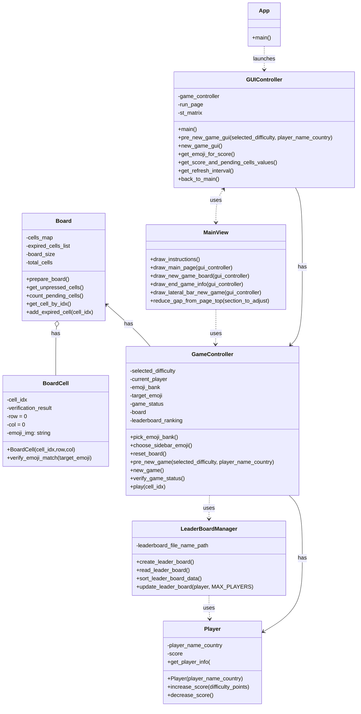
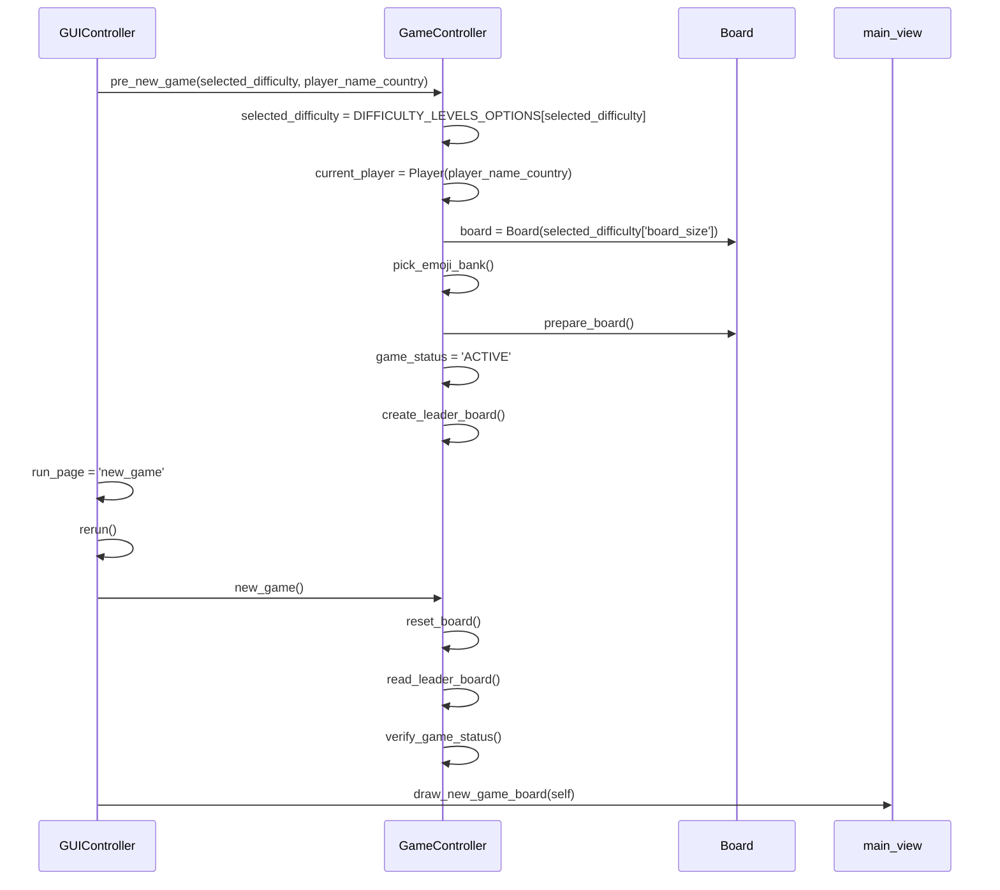

# Ejercicio de migración parte 2

## Migración a objetos

### Objetivo

Incorporar el paradigma de programación orientada a objetos (OOP) y transformar la aplicación en una aplicación en
Streamlit
para favorcer la mantenibilidad del código fuente.

## Código original

* Ver el código fuente del proyecto https://github.com/shakamoushie/pixmatch/blob/main/pixmatch.py . Este proyecto tiene
  un clone del proyecto original
* Interactuar con el juego para entener las funcionalidades principales https://pixmatchgame.streamlit.app
* Instalar el proyecto en su computador local. Escriba desde la línea de comandos y ubicado en la carpeta raíz del
  proyecto `pip install -r requirements.txt`. Note que si no tiene un ambiente virtual primero debe configurarlo.
* Ejecutar el juego localmente. Escriba en consola `streamlit run docs/legacy_version/pixmatch.py`. Su navegador debería
  abrir el juego
  

## Código orientado a objetos

* Este código fuente cumple las mismas funcionalidades que el código legacy pero tiene orientación a objetos
* **Análisis del código actual**
    * Compare la lógica del método ```PreNewGame``` en el código original y en el nuevo código orientado a objetos.
      Identifique como esta separada la lógica relacionada con la visualización con la lógica de negocio
    * Identifique en la versión orientada a objetos en qué puntos se controla la lectura y escritura del leaderboard.
      Considere que una restricción es que solo se escribe y se lee el leaderboard si el jugador escribe su nombre

### Por hacer

1. Agregar caso de prueba que verifique el correcto funcionamiento de la asignación del emoji de la barra lateral en el tablero
2. Agregar caso de prueba para verificar que cuando se pierde el status del juego cambia a 'LOST'.
3. Agregar casos de prueba para clase Player
4. Agregar casos de prueba a cualquiera de las clases ya existentes para los que falten casos de prueba
## Diagrama del proyecto



Editor:https://diagrams.helpful.dev/s/s:MAdFfNUs

### Diagrama de secuencia que representa la interacción cuando se da click en new game
