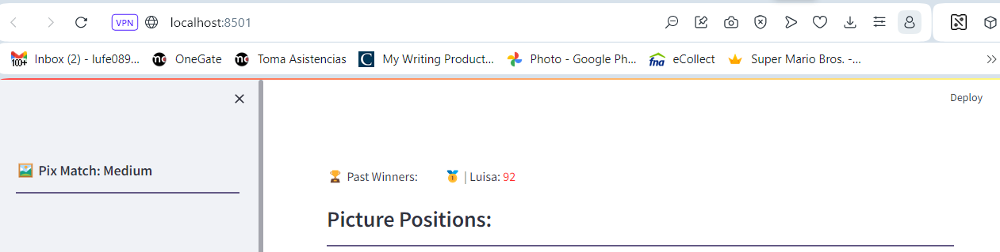
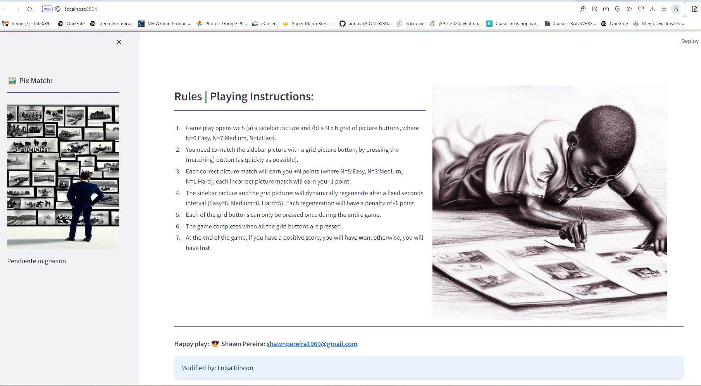
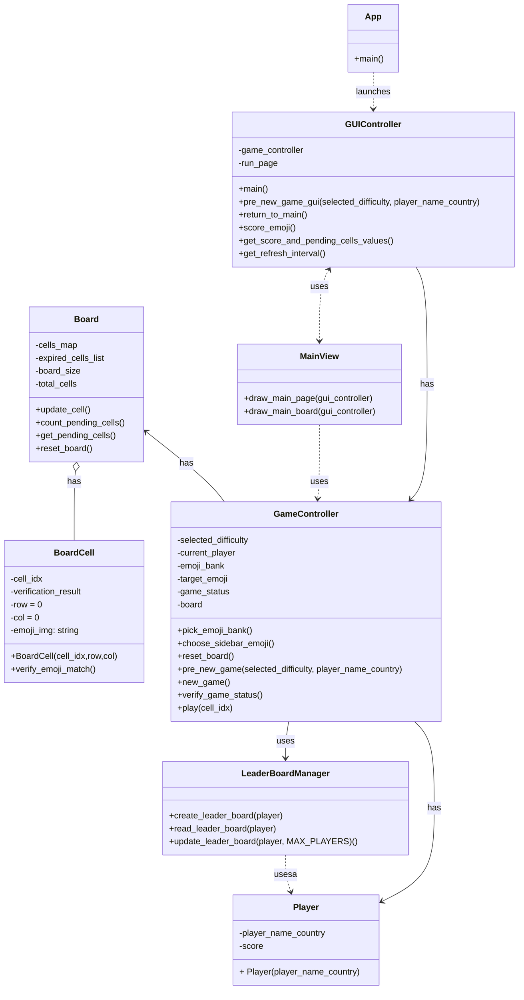

# Ejercicio de migración parte 2

## Migración a objetos

### Objetivo

Incorporar el paradigma de programación orientada a objetos (OOP) y transformar la aplicación en una aplicación en
Streamlit
para favorcer la mantenibilidad del código fuente.

## Código original

* Ver el código fuente del proyecto https://github.com/shakamoushie/pixmatch/blob/main/pixmatch.py . Este proyecto tiene
  un clone del proyecto original
* Interactuar con el juego para entener las funcionalidades principales https://pixmatchgame.streamlit.app
* Instalar el proyecto en su computador local. Escriba desde la línea de comandos y ubicado en la carpeta raíz del
  proyecto `pip install -r requirements.txt`. Note que si no tiene un ambiente virtual primero debe configurarlo.
* Ejecutar el juego localmente. Escriba en consola `streamlit run pixmatch.py`. Su navegador debería abrir el juego
  

## Pendientes

El proyecto tiene la siguiente estructura de directorios:

1. Documentar las clases y métodos que se han creado
2. Genera documentación que explique la estructura de directorios de este proyecto
3. Completar código fuente para lograr funcionalidad completa del juego

## Por hacer
1. Intente correr el proyecto, identifique el script que inicia la interacción y ejecute el compato streamlit run `nombre.py`
2. Debe ver algo como lo siguiente 
3. Inicie la migración iniciando por el radio button de las dificultades

## Diagrama del proyecto

Editor:https://diagrams.helpful.dev/s/s:MAdFfNUs