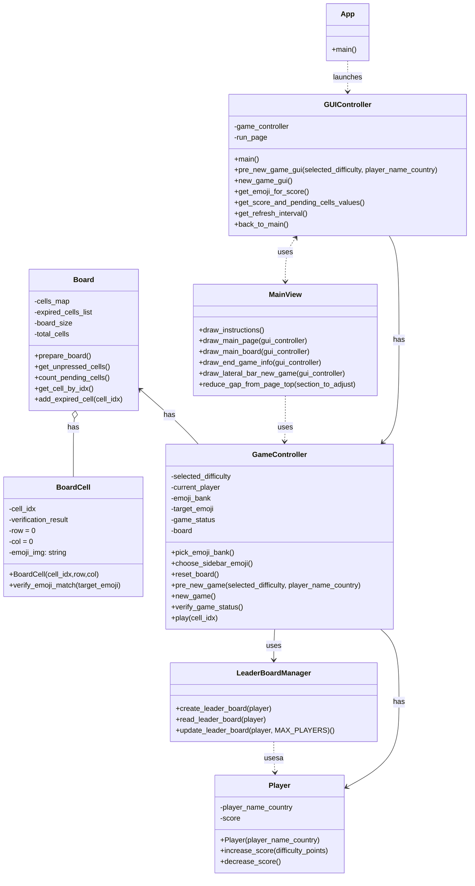

# Ejercicio de migración parte 2

## Migración a objetos

### Objetivo

Incorporar el paradigma de programación orientada a objetos (OOP) y transformar la aplicación en una aplicación en
Streamlit
para favorcer la mantenibilidad del código fuente.

## Código original

* Ver el código fuente del proyecto https://github.com/shakamoushie/pixmatch/blob/main/pixmatch.py . Este proyecto tiene
  un clone del proyecto original
* Interactuar con el juego para entener las funcionalidades principales https://pixmatchgame.streamlit.app
* Instalar el proyecto en su computador local. Escriba desde la línea de comandos y ubicado en la carpeta raíz del
  proyecto `pip install -r requirements.txt`. Note que si no tiene un ambiente virtual primero debe configurarlo.
* Ejecutar el juego localmente. Escriba en consola `streamlit run docs/legacy_version/pixmatch.py`. Su navegador debería abrir el juego
  

## Código orientado a objetos
* Este código fuente cumple las mismas funcionalidades que el código legacy pero tiene orientación a objetos
* Ver el código fuente del proyecto

### Por hacer
1. Agregar lógica para que si el jugador a fallado en más del 50% + 1 de las celdas el juego termine
2. Mostrar en la interfaz gráfica, al lado de "Picture positions" la colección de emojis que se estan usando en el juego
3. Agregar un bonus aleatorio en alguna celda del juego. Este bonus cambia de posición en cada interacción y cuando se descubre suma 5 puntos al puntaje del jugador. Si el bonus se descubre se le avisa al jugador y se vuelve a ubicar en las celdas que no han sido destapadas, siempre y cuando falten más del 20% de las celdas por destapar. El botón que destapó el bonus debe tener un icono que lo identifique
4. Ajustar parametrización de dificultad para poder cambiar el tamaño del tablero predefinido por dificultad
5. Ajustar parametrización inicial para activar o desactivar el autorefresco de la página. Por defecto debe estar desactivado

## Diagrama del proyecto

Editor:https://diagrams.helpful.dev/s/s:MAdFfNUs